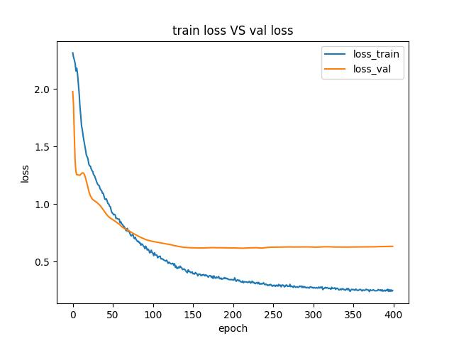
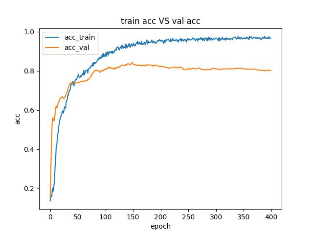

# GCN Predict and Classification
## What did the program do?
Using pytorch's related neural network library, a graph convolutional neural network model (GCN) is written and the node classification and link prediction tasks are completed on the corresponding graph-structured datasets, and finally, the impact of factors such as self-loop, number of layers, DropEdge , PairNorm , and activation function on the model's classification and prediction performance is analysed

## Relate DataSet 

The data used in this project consists of three commonly used graph structure datasets: Cora , Citeseer , and PPI.

(1) Cora: This dataset is a graph data consisting of 2708 machine learning papers as nodes and citation relations between papers as directed edges. [Download link](https://linqs-data.soe.ucsc.edu/public/lbc/cora.tgz) . In addition, a data [link to processing example](https://graphsandnetworks.com/the-cora-dataset/)


(2) Citeseer: This dataset is a graph dataset consisting of 3312 papers and cross-references. The dataset [download link](https://linqs-data.soe.ucsc.edu/public/lbc/citeseer.tgz) . The structure of the paper and the data format are similar to Cora.

(3) PPI: The PPI network is ProteinProteinInteraction (PPI),dataset [download link](http://snap.stanford.edu/graphsage/ppi.zip) .

The dataset [github download link](https://github.com/kimiyoung/planetoid/raw/master/data/) was used in this project.

## Project Struct

`models.py`: 
This code defines a graph neural network (GNN) model for link prediction.

1. **GraphConvolution Class:**
   - This class defines a single layer of a graph convolutional network (GCN).
   - It inherits from `torch.nn.Module` and represents a layer in the neural network.
   - It takes the number of input features (`in_features`), the number of output features (`out_features`), and some optional parameters such as whether to include self-loops (`withloop`), batch normalization (`withbn`), and bias (`bias`).
   - The layer involves a weight matrix (`self.weight`), an optional self-loop weight matrix (`self.self_weight`), batch normalization (`self.bn`), and bias (`self.bias`).
   - The `reset_parameters` method initializes the weights and biases.
   - The `forward` method performs the actual computation of the layer, including matrix multiplication, addition of self-loops, bias addition, and batch normalization.

2. **LinkNet Class:**
   - This class represents the entire graph neural network for link prediction.
   - It consists of multiple layers of graph convolution (`GraphConvolution`) followed by an activation function and dropout.
   - The `encode` method applies the graph convolutional layers to the input features (`x`) and adjacency matrix (`adj`).
   - The `decode` method computes the link prediction based on the embeddings (`z`) and the indices of edge labels.

3. **MUTILAYERGCN Class:**
   - This class is similar to `LinkNet` but is designed for a more general graph classification task.
   - It also consists of multiple graph convolutional layers followed by activation functions and dropout.
   - The `forward` method computes the final output and applies a logarithmic softmax function for classification.

4. **MUTILAYERGCN_PPI Class:**
   - This class is specifically designed for a protein-protein interaction (PPI) graph classification task.
   - It follows a similar structure to `MUTILAYERGCN` but is tailored for the PPI domain.

5. **Activation Function:**
   - The activation function used throughout the model is specified by the `activation` parameter during initialization. Options include ReLU, Tanh, Sigmoid, and Linear.

6. **Normalization and Regularization:**
   - Batch normalization and dropout are applied after each graph convolutional layer to improve the generalization and prevent overfitting.

7. **PairNorm:**
   - There is a `PairNorm` class used for pair normalization, which is applied after each graph convolutional layer.

8. **Other Notes:**
   - The model assumes a certain layer structure with at least two layers.
   - The model is designed to handle graphs represented by adjacency matrices (`adj`) and node features (`x`).

In summary, this code defines a flexible GNN architecture for various graph-related tasks, focusing on link prediction, graph classification, and specifically tailored for protein-protein interaction graphs. It utilizes graph convolutional layers with optional self-loops, batch normalization, and dropout for regularization.

`utils.py`: This code appears to be related to graph neural networks (GNNs) for node classification tasks on citation networks. 

1. **Graph Processing Functions:**
   - `adj_normalize(adj)`: Normalizes the adjacency matrix of a graph.
   - `row_normalize(mx)`: Row-normalizes a sparse matrix.
   - `preprocess_adj(adj, features)`: Normalizes the adjacency matrix and row-normalizes the feature matrix.

2. **Data Loading:**
   - `load_citation(dataset_str="cora", porting_to_torch=True, data_path="data")`: Loads citation network data (e.g., Cora) in a format commonly used for GNNs. It includes features, labels, adjacency matrix, and other information.

3. **Data Preprocessing:**
   - `sparse_mx_to_torch_sparse_tensor(sparse_mx)`: Converts a scipy sparse matrix to a PyTorch sparse tensor.
   - `encode_onehot(labels)`: One-hot encodes categorical labels.
   - `preprocess_adj(adj, features)`: Normalizes the adjacency matrix and row-normalizes the feature matrix.

4. **Model Evaluation:**
   - `accuracy(output, labels)`: Computes the accuracy of model predictions.
   - `roc_auc_compute_fn(y_preds, y_targets)`: Computes the ROC-AUC score for binary classification.

5. **Utility Functions:**
   - `parse_index_file(filename)`: Parses an index file used in data loading.
   - `data_loader(dataset, data_path="data", porting_to_torch=True)`: Loads and preprocesses data for GNN training.

6. **GNN-related Classes:**
   - `PairNorm(nn.Module)`: Implements PairNorm, a normalization technique for GNNs.
   - `DropEdge`: Implements a class for drop edge regularization in GNNs. It includes functions for sampling edges and generating test sets.

7. **Test Set Handling:**
   - `get_test_set(normalization, cuda)`: Returns the test set for GNN evaluation, considering the learning type (transductive or inductive).

8. **Random Edge Sampler:**
   - `randomedge_sampler(percent, normalization, cuda)`: Performs random edge dropout to create a subsampled graph.

9. **Learning Type:**
   - The code considers the learning type as "transductive," indicating that it assumes knowledge of the entire graph during training.

10. **Dependencies:**
    - The code relies on libraries such as PyTorch, NumPy, SciPy, NetworkX, and pickle.


`GCN_predict_train.py`: Training Module for GCN Prediction Networks

`GCN_classification_train.py`: Training Module for GCN Classification Networks

## Train Script

```bash
python GCN_classification_train.py \
    --no-cuda \
    --fastmode \
    --seed 42 \
    --epochs 400 \
    --lr 0.01 \
    --weight_decay 5e-3 \
    --hidden 256 \
    --dropout 0.8 \
    --normalization FirstOrderGCN \
    --dataset cora \
    --datapath "./data/" \
    --no_tensorboard \
    --lradjust
```
```bash
python GCN_predict_train.py \
    --no-cuda \
    --fastmode \
    --seed 42 \
    --epochs 400 \
    --lr 0.01 \
    --weight_decay 5e-3 \
    --hidden 256 \
    --dropout 0.8 \
    --normalization FirstOrderGCN \
    --dataset cora \
    --datapath "./data/" \
    --no_tensorboard \
    --lradjust
```
- `--no-cuda`: Disables CUDA training.
- `--fastmode`: Enables fast mode, validating during the training pass.
- `--seed 42`: Sets the random seed to 42.
- `--epochs 400`: Specifies the number of training epochs.
- `--lr 0.01`: Sets the initial learning rate.
- `--weight_decay 5e-3`: Sets the weight decay (L2 loss on parameters).
- `--hidden 256`: Sets the number of hidden units.
- `--dropout 0.8`: Sets the dropout rate (1 - keep probability).
- `--normalization FirstOrderGCN`: Specifies the normalization on the adjacency matrix.
- `--dataset cora`: Specifies the dataset (you can change it to citeseer or another dataset).
- `--datapath "./data/"`: Specifies the data path.
- `--no_tensorboard`: Disables writing logs to TensorBoard.
- `--lradjust`: Enables learning rate adjustment (ReduceLROnPlateau or Linear Reduce).

## Result
* classification loss



* classification acc



* predict loss


* predict auc

